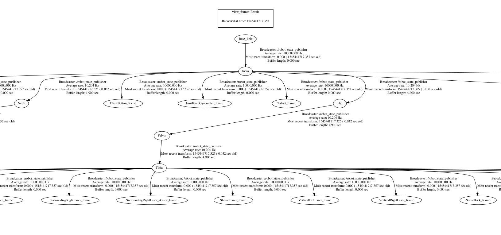
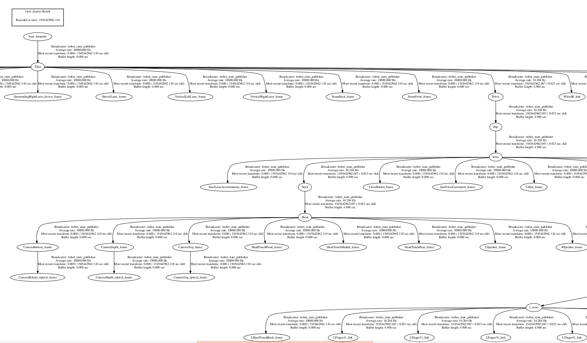

# pepper_description
This Pepper model differs from the original one.

The original model had the root of the tree at
base_link in the torso of the robot. From it the leg, the arms and the head branched out.

In this model the root of the tree is base_footprint at the base of the robot and follows up through the leg
to the torso, from there branches to the arms and head. This is the most common description of mobile base robots you can find.

This model enables the use of ROS standard tools that expect the model to be in a chain of this shape, for example, MoveIt!

The original TF tree ([frames_original.pdf](frames_original.pdf)):

The corrected TF tree ([frames_corrected.pdf](frames_corrected.pdf)):

# Notes
The meshes for the Pelvis, Hip & Torso needed to have their origin modified as the joints in the URDF rotate over that origin. Given I used **meshlab** to do this operation, at the exporting step one loses the fancy colors & effects so the meshes don't look that nice. I also needed to fix by hand in the .dae files the references to materials and image materials by copying them from the originals. But the format is not the same (originally polylist, in the meshlab exported triangles) so I don't know how to re-apply the fancy colors & effects.

If anyone knows, it will be nice to conserve them.
